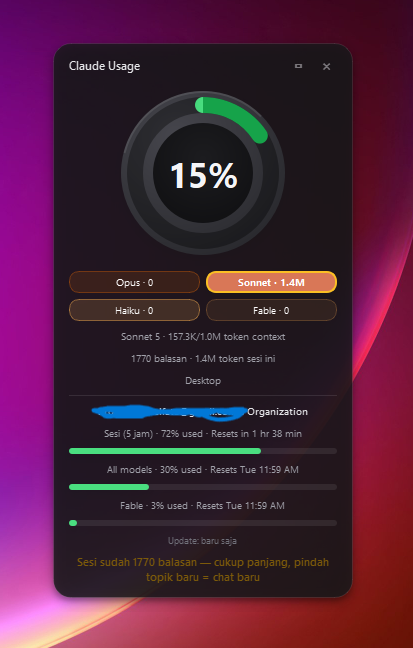
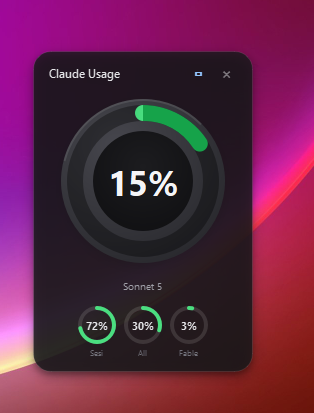

# Claude Usage Widget

A minimalist desktop widget (Windows) for monitoring Claude token usage in real time, from two data sources:

- **Local** — context window & tokens per model (Opus/Sonnet/Haiku/Fable), read directly from Claude Code logs (`~/.claude/projects/**/*.jsonl`), updated every 2 seconds.
- **Official** — 5-hour session quota & weekly (7-day) quota, read from `claude.ai/settings/usage` through a native WebView2 window (not Playwright/automation, so it isn't blocked by Cloudflare), login once manually and it keeps running in the background.

## Features

- Context window ring gauge (color changes at the 75%/85% thresholds)
- Per-model badges, clickable to "pin" the ring to a specific model
- Session & weekly quota bars (including per-model breakdown when available, e.g. Fable)
- Notifications/nudges: suggests `/compact` or a new chat when context is full, suggests switching model when Opus dominates session usage
- System tray (minimize, refresh, compact mode)
- Optional auto-start via the Windows Startup folder

## Preview

| Full mode | Compact mode |
|---|---|
|  |  |

---

## Requirements

- **Windows 10/11** (this widget is Windows-specific — it uses WebView2 and the Windows system tray)
- **Python 3.9+** — check with `python --version`
- **Claude Code** used at least once (so local context data can be found — if not, the ring will show "No session found" until you start chatting)
- **WebView2 Runtime** — usually already installed on modern Windows 10/11. If not, download it from [developer.microsoft.com/microsoft-edge/webview2](https://developer.microsoft.com/en-us/microsoft-edge/webview2/)
- A **Claude.ai** account (Free/Pro/Max) for the official quota section (optional — the widget still runs without it, only the official quota section stays empty)

## Installation

```bash
git clone https://github.com/abukhalid-io/claude-usage-widget.git
cd claude-usage-widget
pip install -r requirements.txt
python claude_usage_widget.py
```

## How to Use (Step by Step)

1. **Run the widget** — `python claude_usage_widget.py`. The widget appears in the top-right corner of the screen.
2. **The context window ring** activates immediately if you've already used Claude Code before — no setup needed.
3. **Log in for official quota data (one time only)** — as soon as the widget opens, a small browser window ("Login Claude") also opens automatically behind it. Log in to your Claude.ai account there:
   - If your account has an email+password option, just log in normally.
   - **If your account can only log in via Google** — the "Continue with Google" button **will not work** in this window (Google deliberately blocks login from embedded browsers, this is Google's own security policy, not a widget bug). Use the **"Continue with email"** button instead, then enter the OTP code sent to your email.
4. Once logged in successfully, that window **hides itself automatically** and won't reappear as long as the login session stays valid (usually lasts a long time). The "Session (5 hours)" and "Weekly" bars in the widget will immediately fill in with real data from your account.
5. The widget now runs on its own in the background, updating continuously — just leave it open (or minimize it to the tray).

### If the login session expires

Sometimes the login session expires (usually after a few weeks). The widget will automatically detect this, show a "session expired" status in the official quota section, and the small browser window will **reappear on its own** asking you to log in again — no need to restart the widget.

### Auto-start on Windows boot (optional)

To have the widget run automatically every time you log into Windows, with no console window showing:

1. Press `Win + R`, type `shell:startup`, Enter
2. Create a new shortcut in that folder pointing to `pythonw.exe` (not `python.exe`, so no console appears) with an argument pointing to `claude_usage_widget.py`
   - Example shortcut target: `"C:\Path\to\Python\pythonw.exe" "C:\Path\to\claude-usage-widget\claude_usage_widget.py"`

## Controls

| Action | Function |
|---|---|
| Click-and-hold the widget body | Move the widget |
| `×` button | Minimize to system tray (not quit) |
| Right-click the tray icon | Show/Hide, Refresh now, Compact mode, Quit menu |
| `▭` button in the header | Toggle compact mode (minimal, ring only) |
| Click a model badge (Opus/Sonnet/Haiku/Fable) | "Pin" the ring to that model — click again to unpin, ring goes back to auto-following the currently active model |

## Understanding the Display

- **Large ring (context window)** — how full the conversation you currently have open is (local context, from Claude Code logs). This is different from the quota below it!
- **Opus/Sonnet/Haiku/Fable badges** — total tokens used per model in the currently active session/chat.
- **"Session (5 hours)" & "Weekly" bars** — official quota from your Claude.ai account (Pro/Max subscription rate limit), independent of which chat is currently open.
- **Yellow warning toast** — appears automatically when the context window is nearly full or when Opus dominates the session's token usage.

## Troubleshooting

| Problem | Solution |
|---|---|
| Ring shows "No session found" | Claude Code hasn't been used on this computer yet — open Claude Code, chat once, then check again |
| "Continue with Google" errors / login fails | Use "Continue with email" in the login window (see How to Use section) |
| Official quota bars stay empty / "not found" | The login window may have been closed before finishing — restart the widget and leave the login window open until it completes |
| Widget disappears after clicking `×` | That's expected — it minimizes to the tray instead of closing — check the icon in the system tray (near the clock) |
| Widget is duplicated / out of sync | Don't run `python claude_usage_widget.py` twice at the same time |

## Privacy

The login session (`webview_profile/`), usage data (`usage_data.json`), and debug logs are never committed to this repo (see `.gitignore`) — everything stays stored locally on your own computer. The widget only reads your own local data and the official Claude.ai usage page — no data is ever sent to any third-party server.
